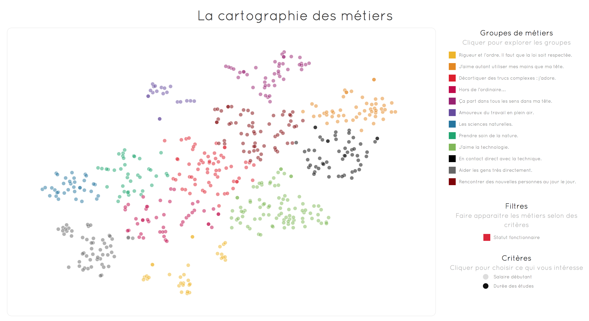

======
Impala
======

Ce projet est une collaboration entre [Impala](http://www.impala.in) et [Data for Good](http://www.dataforgood.fr).
Le résultat est une cartographie qui utilise les données des métiers de l'ONISEP.

  

Les données proviennent du site de l'ONISEP mais ne sont pas présentées ici. 
